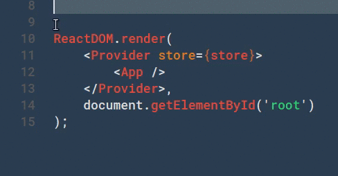
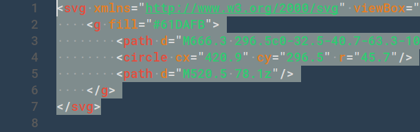
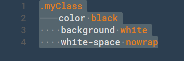

# BetterWhiteSpace

Sublime-like tab and space rendering on selection for VSCode.

#### Tab Rendering

#### Space Rendering

#### Tabs + Spaces

> This is especially useful to verify you're not mixing tabs & spaces.

## Extension Settings

This extension contributes the following self-explanatory settings:

* `whitespace.color.dark`
* `whitespace.color.light`

---

Credits to @spywhere for code structure